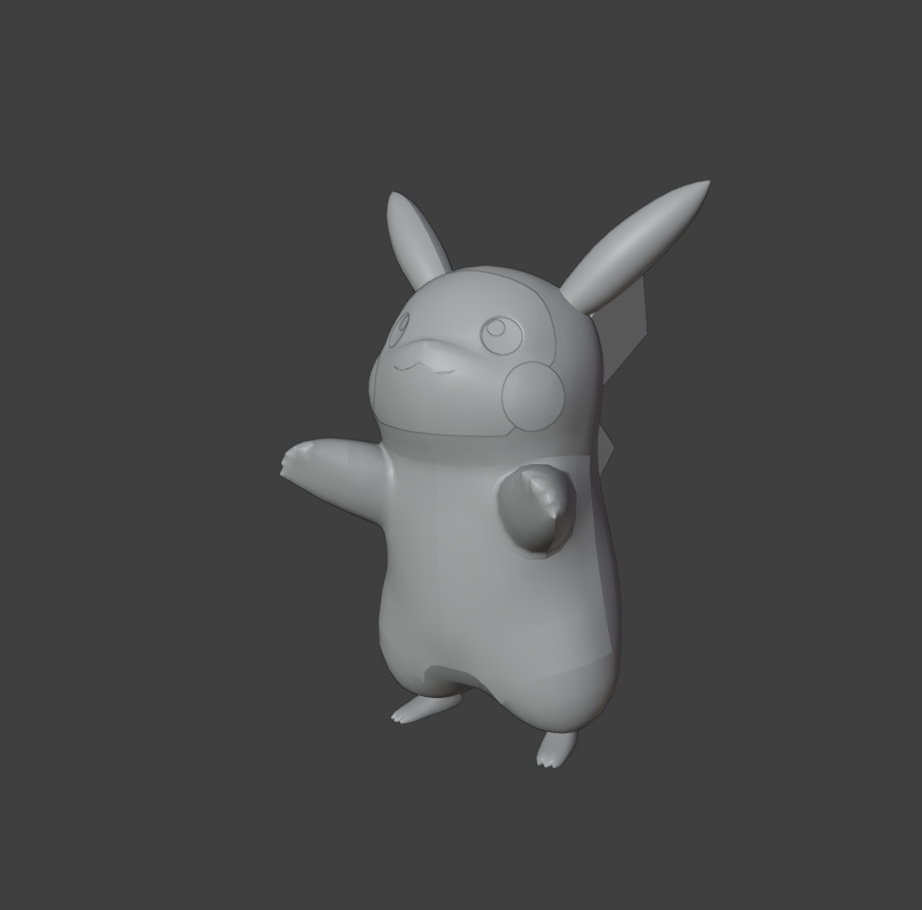
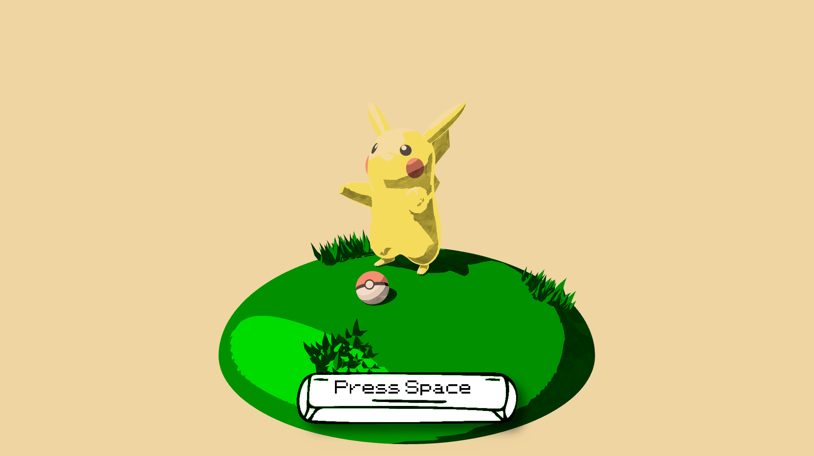
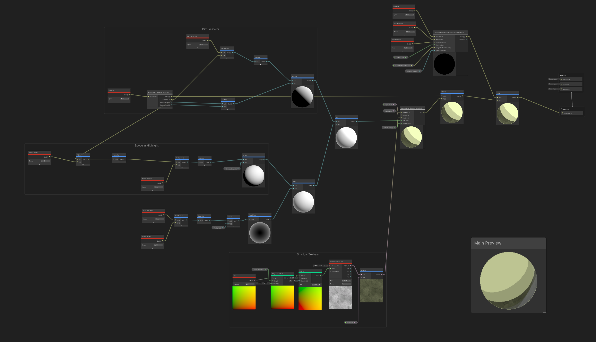
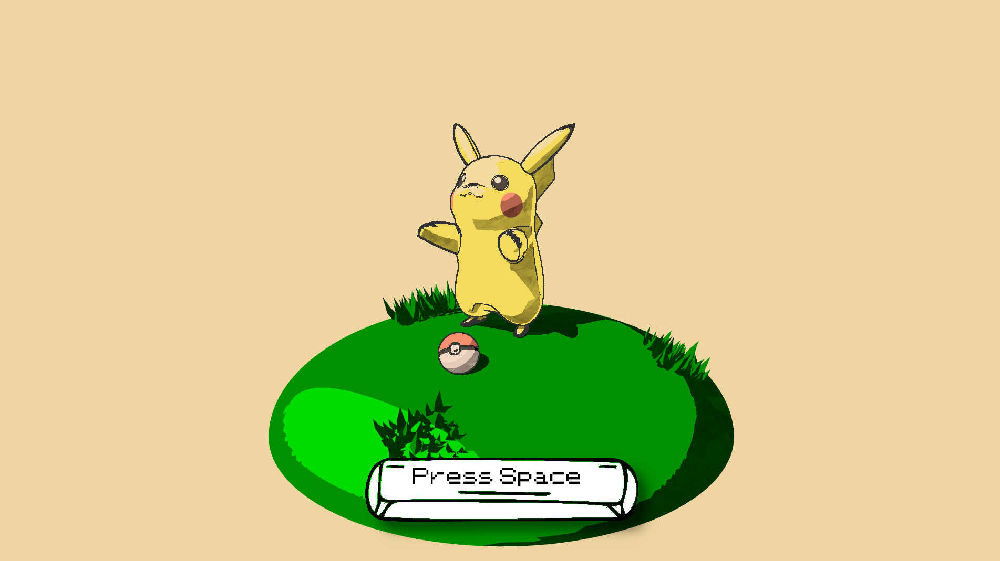
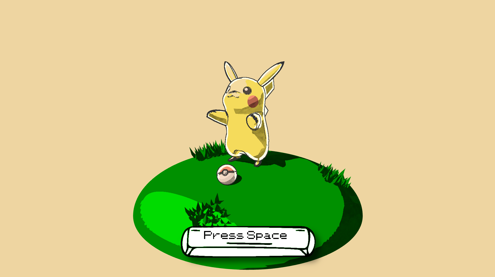
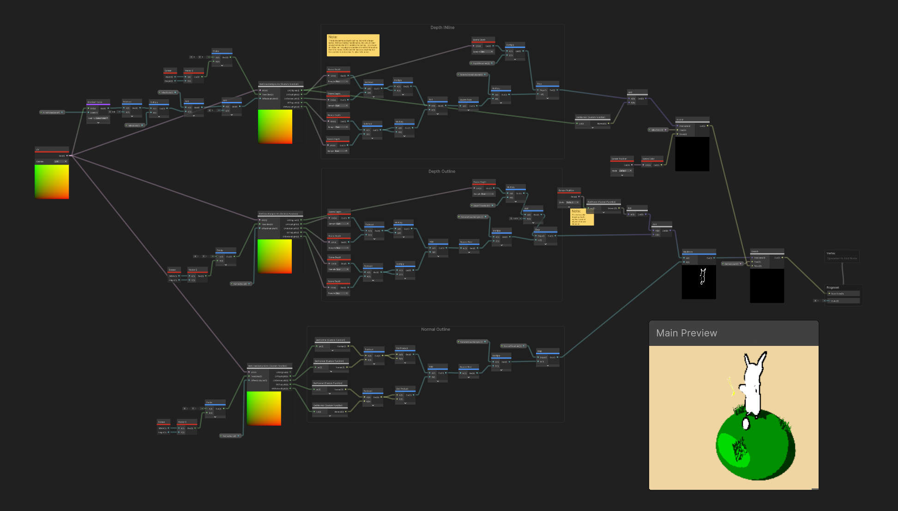
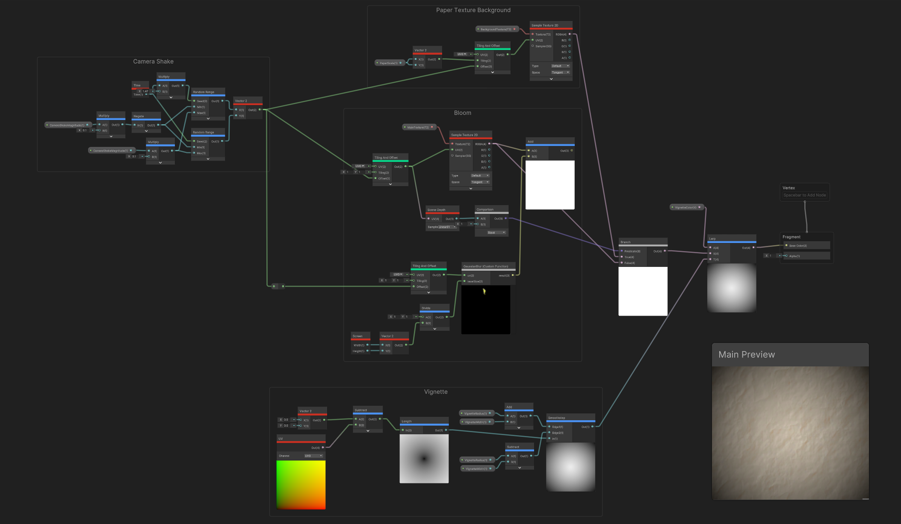
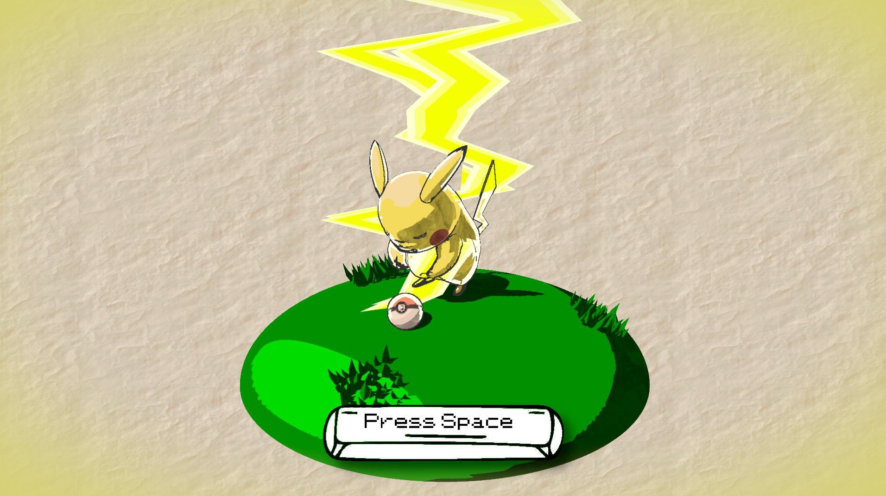

# Stylized Procedural Toon Shader

The goal of this project was to practice non-photorealistic rendering techniques. I chose an artwork that inspired me (see attributions at the end of this document), and attempted to emulate it procedurally, in Unity's shadergraph (URP pipeline).

## Live Demo
Check out and interact with my [pokemon scene here!](https://mzschwartz5.github.io/hw04-stylization/)

[Or just watch the video!](https://www.youtube.com/watch?v=LpJujW6Vtpo)

# VFX Breakdown

## Toon shading

This is what pikachu looks like before we get started! Just some simple smooth shading on the base 3D model:

To achieve a cartoonish look, the first step is to realize that cartoons quantize color values. That is, shading on cartoon models does not smoothly vary across a surface, but tends to fall into buckets: shadow, midtone, and highlight. By calculating lighting as normal - say, via a blinn-phong model of diffuse, specular, and ambient lighting - and then using thresholds to put a light value into a color bucket, we can get basic toon shading:

One thing to note, is that I'm also using a texture (which I made in procreate) to give the shadow tones some extra depth, and (hopefully) make them feel sort of like watercolor.

And here's the shader graph to create this (note the custom function node `ChooseColor` - that's what does the thresholding):

## Outlines and Inlines

The above render of pikachu is still missing something... it needs more detail. For that, we can add outlines! This is most often done after the main render pass, which is exactly what I did. Using the Robert's cross algorithm, we can can compare each pixel to neighbors (in a cross pattern) and determine if a pixel constitutes an edge. In my case, I used this algorithm on both the normals and depth of each pixel. (So, for example, if a pixel has a very different scene depth than its neighbors, it's probably an edge!) With that, we get outlines:

That looks so much nicer. But if you look at my reference photo (at the bottom of this README), you'll notice that the characters also have some white space between the outline and the rest of the shading. It really makes it look more like watercolor, because with that medium, you wouldn't easily be able to color exactly to the lines without bleeding over. 

This effect is a little trickier to achieve, but we can leverage the existing outline algorithm. In Robert's cross, the kernel size (aka how close or far the neighboring pixels you check are) determines the width of the outline. So, we can achieve an *inline* by doing a different color outline, and just making it wider than the initial outline. The only issue here, is that this will also color pixels *outside* of the outline; not just inside. To limit where we draw this inline, we can reference the normal texture used for normal-based outlines. This texture only contains pikachu, because we drew to it with a layer mask. So, if a pixel has an inline according to the Robert's cross algorithm, AND it's a pixel in the normal texture, we give it the inline:

I think this really sells the watercolor medium. Also, the neat thing about this approach is that, the way Robert's cross works, you only need 5 pixel samples no matter how big the kernel, so it's not very expensive to get a wide white inline. 

And here's the shadergraph for reference:

## Post processing

Besides outlines, I use a second full screen render feature in this project to apply a variety of other postprocess effects:
- Applying a paper texture to the background
- Camera shake (when the lightning happens)
- Vignette 
- Bloom 

The bloom effect also uses a layer mask approach so that I could capture just the lightning in a bloom texture, and then apply gaussian blur (via a custom function node) to it, before adding it back to the original image. I wasn't able to get as strong of an effect here as I'd like. It could be an implementation flaw, or perhaps I need to use HDR to really see an effect.

In any case, here's pikachu with all that postprocessing:

And the shadergraph for it:

## Lightning

What's pikachu without a little thunderbolt? I figured the best way to achieve this, adhering to the cartoonish style, was to use a plane (20x10 verts) and deform it with a vertex shader to look somewhat like lightning. Basically just a simple noisy sine wave driven by time, with some other parameters to stylize it like a taper, base width, frequency + amplitude, etc. As for the fragment shading, I wanted it to be similarly toonish. However, since the lightning is a flat plane, I couldn't use the same approach as with the 3D models. Instead, I chose to artificially color the bolt dark-to-light from the middle outwards. 

This was a little tricky, actually, because "middle" should be with respect to the original plane, before deformation. However, vertex deformation has already occured at this point. By using a custom output in the vertex shader (the offset of each vertex from its original position), I was able to essentially recompute each pixel's original location on the plane and shade accordingly:

And, of course, the shader graph:

# Miscellaneous

You may have noticed some other things among these pictures - namely, grass, a pokeball, a UI spacebar, and the fact that Pikachu is animated (and, if you played the video or live demo, the sound effects)! A brief overview of some of those miscellaneous effects that really help breathe life into the scene:

- Scene elements: plain and simple, I downloaded a few assets (low poly grass, pokeball) off of sketchfab! For the grass mound, I just cut an icosphere in half and squished it, in Blender.

- The UI was actually more challenging than I expected. It was near impossible to find free UI assets online. I found something spacebar-esque, but then had to heavily process it in GIMP (remove the background, add drop shadow to simulate it being pressed / lifted, added pokemon-font text).

- The animation was done in Blender. The pikachu model came rigged, so I just did some standard keyframing (of course, matching it up to the audio that would eventually be played over it). I realized later that it was too smooth for a cartoon, so I turned off keyframe interpolation and just used more keyframes to get a choppier look.

# Attributions

- [Inspiration image](https://pbs.twimg.com/media/DpCNHXtWkAAmfWj?format=jpg&name=900x900)

- "Pikachu" (https://skfb.ly/o6rpG) by HarrisonHag1 is licensed under Creative Commons Attribution (http://creativecommons.org/licenses/by/4.0/).

- "low poly grass clump" (https://skfb.ly/otrFR) by sam is licensed under Creative Commons Attribution (http://creativecommons.org/licenses/by/4.0/).

- [Inspiration for lightning](https://static.wikia.nocookie.net/randomvideogames/images/f/fb/Pikachu_thunderbolt.png/revision/latest?cb=20110911001314)

- [Spacebar clip art, unmodified](https://media.istockphoto.com/id/1451059072/vector/pacebar-keyboard-keyboard-buttons-black-white.jpg?s=612x612&w=0&k=20&c=sIlUbxIOVbAc4lQPk8yzLICX_5FKYgWNkAOV15n8Fdo=)

- [Pokemon Red font](https://www.dafont.com/pkmn-rbygsc.font)

- [Paper texture](https://www.deviantart.com/fantasystock/art/Seamless-Parchment-Texture-58517493)

- [Sound effects](https://www.fineshare.com/soundboards/pikachu-soundboard/)

- [Background music](https://downloads.khinsider.com/game-soundtracks/album/pokemon-red-green-blue-yellow/03%2520Title%2520Screen.mp3)